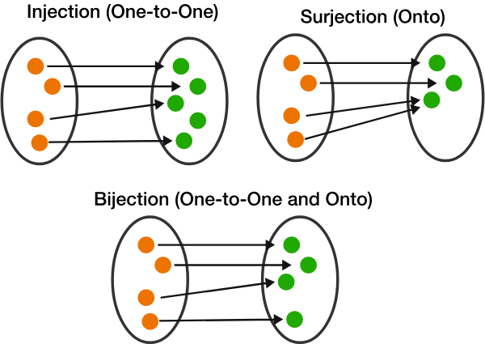

# Natural Numbers
## Peano Axioms

- **(Axiom 2.1)** Zero
    - 0 is a natural number
- **(Axiom 2.2)** $++$, the increment operation
    - if $n$ is a natrual number, then $n++$ is also a natural number.
- **(Axiom 2.3)** $0$ is the first
    - $n++ \neq 0$ for every natrual number n
- **(Axiom 2.4)** Uniqueness of increment
    - $n \neq m \implies n++ \neq m++$
- **(Axiom 2.5)** Principal of mathimatical induction
    - $[P(0) \land (P(n) \implies P(n++))] \implies [\forall n P(n)]$
      - $P(n)$ is a property pertaining to natural number $n$
- *(Definition 2.2.7)* Positive natural
  - $n$ is positive $\iff n \neq 0$
- *(Corollary 2.2.9)* $a + b = 0 \implies a = 0 \land b = 0$
- *(Lemma 2.2.10)* $a > 0 \implies (\exists ! b) b++ = a$
- *(Proposition 2.2.14)* Strong principal of induction
    - $(\forall m \ge m_0) [[(\forall m_0 \le m' < m) P(m') \implies P(m)] \implies (\forall m \ge m_0) P(m)]$
      - $m_0$ is any natrual number, $P(m)$ is a property pertaining to natural number $m$
    - Break down version:
      - $\forall m_0 [(\forall m \ge m_0) Q(m) \implies (\forall m \ge m_0) P(m)]$
      - $Q(m)$ is defined as:
        - $(\forall m_0 \le m' < m) P(m') \implies P(m)$

## Precedence of logical operator
> The convention is described by Herbert Enderton in [A Mathematical Introduction to Logic](https://books.google.it/books?id=dVncCl_EtUkC&pg=PA78) page 78.

| Operator             | Name           | Precedence     |
| -------------------- | -------------- | -------------- |
| $\forall$, $\exists$ | Modifier       | Highest, apply to as little as possible |
| $\lnot$              | Negation       | Highest, apply to as little as possible |
| $\land$             | Conjunction    |
| $\lor$               | Disjunction    |
| $\implies$        | Implication    | Right associative |
| $\iff$    | Biconditional  |

- Examples (todo: Not convinced!!!)
    - $¬α ∧ β$ is $((¬α) ∧ β)$, and not $¬(α ∧ β)$
    - $∀x α → β$ is $(∀x α) → β$, and not $∀x(α → β)$
    - $∃x α ∧ β$ is $(∃x α) ∧ β$, and not $∃x(α ∧ β)$.
    - $α → β → γ$ is $α → (β → γ)$.

## Logic
- $\forall$ Equivalent
  - $(\forall x \in X)  Q(x)$
  - $\forall x [x \in X \implies Q(x)]$
- $\exists$ Equivalent
  - $(\exists x \in X)  Q(x)$
  - $\exists x [x \in X \land Q(x)]$

## Axioms of Equality (A.7)
How equality is defined depends on the class type of objects under consideration. But all **equality definition** should obey the following four axioms of equality:
1. Reflexive axiom.
    - Given any object x, we have x = x.
1. Symmetry axiom.
    - Given any two objects x and y of the same type, if x = y, then y = x.
1. Transitive axiom.
    - Given any three objects x, y, z of the same type, if x = y and y = z, then x = z.
1. Substitution axiom.
    - Given any two objects x and y of the same type, if x = y, then f(x) = f(y) for all functions or operations f.
    - Similarly, for any property P(x) depending on x, if x = y, then P(x) and P(y) are equivalent statements.
    - Note, when introducing an opertion to objects of type T, it's considered a **well-defined** operation only if it follows the Substitution axiom.

# Set Theory
## Axiom vs. Definition
An axiom is a assumption/rule that we decide we will follow/enforce.
Axioms come mainly in two different kinds: existential and universal.
1. Existential: there exists an empty set
2. Universal: all right angles are equal (?)

### ZFC Axiom of Set Theory
- *(Definition 3.1.1)* Informal Set
    - A set is unordered collection of objects(*)
    - If $x$ is an object, then
        - $x$ is an element(*) of set A, i.e. $x \in A$, if $x$ lies in the collection
        - $x \notin A$, if $x$ does not lie in the collection
- **(Axiom 3.1)** Sets are objects
    - A is a set => A is an object
        - In particular, given set A and B, it's meaningful to ask if $A \in B$
- *(Definition 3.1.4)* Equality
    - $A = B \iff \forall x [(x \in A \implies x \in B) \land (x \in B \implies x \in A)]$
- **(Axiom 3.2)** Empty set exists
    - $(\exists \emptyset) (\forall \ object \ x ) x \notin \emptyset$
- *(Lemma 3.1.6)* Single choice
    - $A \neq \emptyset \implies \exists x (x \in A)$
    - Note: the antecedent assumes non empty set A exists. this lemma does NOT prove that A exists
- **(Axiom 3.3)** Singleton/pair sets exist
    - Singleton $\lbrace a \rbrace$: $\forall (object \ a) \exists A \forall (object \ y) (y \in A \iff y = a)$
    - Pair $\lbrace a, b \rbrace$: $\forall (object \ a) \forall (object \ b) \exists A \forall (object \ y)(y \in A \iff y = a \lor y = b)$
- **(Axiom 3.4)** Pairwise union exists
    - $\forall A \forall B [A \cup B \ exists]$
    - $A \cup B$ is defined as:
      - $\forall x (x \in A \cup B \iff x \in A \lor x \in B)$
- *(Defnition 3.1.15)* Subsets
    - $A \subseteq B \iff \forall \ object \ x (x \in A \implies x \in B)$
- **(Axiom 3.5)** Axiom of specification/separation
    - Set $\lbrace x \in A \mid P(x) \rbrace$ exists
    - And it's defined as: $(\forall y) [y \in \lbrace x \in A \mid P(x) \rbrace \iff y \in A \land P(y)]$
- *(Defnition 3.1.23)* Intersections
    - $S_1 \cap S_2 := \lbrace x \in S_1 \mid x\in S_2  \rbrace$
    - In other words: $x \in S_1 \cap S_2 \iff x \in S_1 \land x\in S_2$
- *(Defnition 3.1.27)* Difference Sets
    - $A \backslash B := \lbrace x \in A \mid x\notin B  \rbrace$
- **(Axiom 3.6)** Replacement
    - $(\forall x \in A) \forall y \lbrace [\forall y_1 \forall y_2 (P(x,y1) \land P(x,y2) \implies y_1 = y_2)] \implies Set \ \lbrace y \mid (\exists x \in A) P(x,y)  \rbrace \ exists  \rbrace$
      - Informal: $(\forall x \in A) \forall y [\text{at most one y for any x, s.t. P(x,y) holds} \implies \ \lbrace y \mid (\exists x \in A) P(x,y)  \rbrace \text{exists}]$
    - $z \in \lbrace y \mid (\exists x \in A) P(x,y)  \rbrace \iff (\exists x \in A) P(x,z)$
- **(Axiom 3.7)** Infinity
    - $\mathbb{N}$ exists, and its elements are called natural numbers.
    - $0 \in \mathbb{N} \land (n \in \mathbb{N} \implies n++ \in \mathbb{N})$ and Peano Axiom holds
- **(Axiom 3.8)** Universal specification (**Not chosen**)
  -  $\forall P [\forall x P(x) \ exists \implies \lbrace x \mid P(x) \rbrace \ exists]$
  - And it's defined as: $(\forall y) [y \in \lbrace x \mid P(x) \rbrace \iff P(y) \ is \ true]$
- **(Axiom 3.9)** Regularity/Foundation
  -  $(\forall set A \neq \emptyset) (\exists x \in A) [x \ is \ not \ a \ set \lor x \cap A  = \emptyset]$
- **(Axiom 3.10)** Power set
  -  $(\forall set X) (\forall set Y) (Y^X \ exists)$
  - $Y^X := \lbrace f \mid f: X \to Y  \rbrace$
    - $f \in Y^X \iff f \text{ is a function with domain X and range Y}$
- **(Axiom 3.11)** Union
  -  $(\forall x \in A) [x \ is \ a \ set] \implies \bigcup A \ exists$
  - $\bigcup A$ is defined as:
    - $x \in \bigcup A \iff (\exists S \in A) x \in S$
  - $\bigcup_{\alpha \in I} A_{\alpha} := \bigcup\lbrace A_\alpha \mid \alpha \in I \rbrace$
    - $x \in \bigcup_{\alpha \in I} A_{\alpha} \iff (\exists \alpha \in I) x \in A_\alpha$
  - $\bigcap_{\alpha \in I} A_{\alpha} := \lbrace x \in A_\beta \mid (\forall \alpha \in I) x \in A_\alpha \rbrace$
    - $x \in \bigcap_{\alpha \in I} A_{\alpha} \iff (\forall \alpha \in I) y \in A_\alpha$

## Functions
- *(Definition 3.3.1)* Functions
    - $f: X \to Y$ is defined as:
      - $(\forall set X) (\forall set Y) [(\forall x \in X) (\exists! y \in Y )P(x, y) \implies (\exists f: X \to Y) (\forall x \in X) (\exists! f(x) \in Y) P(x, f(x))]$
- *(Definition 3.3.7)* Equality of Functions
    - Consider two functions $f : X \to Y$ and $g : X \to Y$
      - Note $f$ and $g$ have the same domain and range.
    - $f = g \iff (\forall x \in X) [f(x) = g(x)]$
- *(Definition 3.3.10)* Composition
    - Consider two functions $f : X \to Y$ and $g : Y \to Z$
    - $(g \circ f)(x):= g(f(x))$
- *(Definition 3.3.14)* One-to-one functions (injective)
    - $x \neq x' \implies f(x) \neq f(x')$
- *(Definition 3.3.17)* Onto functions (Surjective)
    - Often written as $f(X) = Y$
    - $(\forall y \in Y) (\exists x \in X) f(x) = y$
- *(Definition 3.3.20)* Bijective functions (invertible)
    - both bijective and surjective; also called "perfect matching", "one to one correspondence".
    - $(\forall y \in Y) (\exists! x \in X) f(x) = y$
      - At least one $x$ because of surjectivity, and at most one $x$ because of injectivity
    - $(\forall x \in X) (\exists! y \in Y) f(x) = y$ by definition of "function"
    - 
- *(Excercise 3.3.8)* Inclusion map (iota)
    -  $X \subseteq Y$, Inclusion map $\iota_{X \to Y}: X \to Y$ is defined as:
    - $(\forall x \in X) \iota_{X \to Y}(x):=x$
    - Identity map: $\iota_{X \to X}: X \to X$
- *(Definition 3.4.1)* Image of sets
    - $f(S) := \lbrace f(x) \mid x \in S  \rbrace$
      - $ \mid $ reads: "for some"
      - $y \in f(S) \iff (\exists x \in X) y = f(x)$
      - $f : X \to Y$, $S \subseteq X$, $f(S) \subseteq Y$
- *(Definition 3.4.4)* Inverse Images
    - $f^{-1}(U) := \lbrace x \in X \mid f(x) \in U  \rbrace$
      - $ \mid $ reads: "such that", "and"
      - $x \in f^{-1}(U) \iff f(x) \in U$
      - $f : X \to Y$, $U \subseteq Y$
- Function and set with $ \mid $ 
    - *(Axiom 3.5 Specification)* Set $\lbrace x \in A \mid P(x) \rbrace$ exists
    - *(Axiom 3.6 Replacement)* Set $\lbrace y \mid (\exists x \in A) P(x,y)  \rbrace$ exists
      - $z \in \lbrace y \mid (\exists x \in A) P(x,y)  \rbrace \iff (\exists x \in A) P(x,z)$
    - *(Example 3.1.32)* $\lbrace f(x) \mid x \in A  \rbrace$
      - shorthand for: $\lbrace  y \mid y = f(x) \text{ for some } x \in A \rbrace$
      - $y \in \lbrace f(x) \mid x \in A  \rbrace \iff (\exists x \in A) y = f(x)$
    - *(Definition 3.4.1)* $f(S) := \lbrace f(x) \mid x \in S  \rbrace$

### Cartesian Product of Set
- *(Definition 3.5.1)* Ordered pair
    - Ordered pair exists: $\forall x \forall y \exists (x,y)$
      - Proof by construction: $(x, y) := \lbrace \lbrace x \rbrace, \lbrace x, y \rbrace \rbrace$
    - Ordered pair equality: $(x, y) = (x', y') \iff x = x' \land y = y'$
- *(Definition 3.5.4)* Cartesian Product (Collection of ordered pairs)
  - $X \times Y := \lbrace (x, y) \mid x \in X \land y \in Y \rbrace$
    - $X \times Y$ is a set, and it exists.
    - $ \mid $ reads "for some"
    - $a \in (X \times Y) \iff (\exists x \in X) (\exists y \in Y) a = (x, y)$
- *(Definition 3.5.7)* Ordered n-tuple and n-fold cartesian product
  - Ordered n-tuple
    - Notation
      - $(x_i)_{1 \leq i \leq n}$
      - $(x_1, ..., x_n)$
    - Equality
      - $(x_i)_{1 \leq i \leq n} = (y_i)_{1 \leq i \leq n} \iff (\forall i \in \lbrace 1,...,n \rbrace) x_i = y_i$
  - N-fold cartesian product (of an ordered n-tuple of sets)
    - Notation
      - $X^n$
      - $\prod_{1 \leq i \leq n} X_i$
      - $\prod_{i=1}^n X_i$
      - $(X_1 \times ... \times X_n)$
    - Definition
      - $\prod_{1 \leq i \leq n} X_i := \lbrace (x_i)_{1 \leq i \leq n} \mid (\forall i \in \lbrace 1,...,n \rbrace) x_i \in X_i \rbrace$
        - $a \in \prod_{1 \leq i \leq n} X_i \iff [(\forall i) [(1 \leq i \leq n) \implies(\exists x_i) x_i \in X_i]] \land a = (x_j)_{1 \leq j \leq n}$
- *(Excercise 3.5.7)* Coordinate Function and Direct Sum
  - Coordinate functions on $X \times Y$
    - $\pi_{X \times Y \to X} : X \times Y \to X$ and $\pi_{X \times Y \to X}(x,y) := x$
    - $\pi_{X \times Y \to Y} : X \times Y \to Y$ and $\pi_{X \times Y \to Y}(x,y) := y$
  - $(\forall f : Z \to X) (\forall g : Z \to Y) (\exists! h : Z \to X \times Y) \pi_{X \times Y \to X} \circ h= f \land \pi_{X \times Y \to Y} \circ h= g$
    - $h$ is the direct sum of $f$ and $g$, denoted $h := f \bigoplus g$
- *(Excercise 3.5.10)* Graph
  - $f : X \to Y$ is a function
  - Graph of $f$ is a set: $\lbrace (x, f(x)) \mid x \in X \rbrace$
- *(Definition 3.6.1)* Equal cardinality of two sets
  - $X$ and $Y$ have equal cardinality $\iff$ there exists a bijection $f : X \to Y$
- *(Definition 3.6.5)* Assign cardinality of set $X$ to a natural number $n$
  - $X$ has cardinality $n$ $\iff$ $X$ has equal cardinality with $\{i \in N \mid 1 \leq i \leq n \}$
- *(Definition 3.6.10)* finite sets
  - Set $X$ is finite $\iff$ $X$ has cardinality $n$ for some natural number $n$
    - $\#(X) := n$

## Integers
- *(Definition 4.1.1)* Integers
  - $a,b,c,d \in N$ Define equivalence relation ~ on $N \times N$
    - $(a, b) \sim (c, d) \iff a + d = c + b$
  - $a -- b := \lbrace (c, d) \in N \times N \mid (a, b) \sim (c, d) \rbrace$
    - integer is defined as a set of equivalent ordered pairs of natural numbers
  - Let $Z$ denote all set of integers. 
- *(Definition 4.1.2)* Integer operations
  - Sum of two
    - $(a--b) + (c--d) := (a+c) -- (b+d)$
      - well-defined:
      - if $(a--b) = (a'--b')$, to show $(a--b) + (c--d) = (a'--b') + (c--d)$
        - By "+" definition, $LHS = (a+c) -- (b+d)$ and $RHS = (a'+c) -- (b'+d)$
        - To prove LHS = RHS is to show $(a+c)+(b'+d)=(a'+c)+(b+d)$
        - use $(a--b) = (a'--b') \iff a+b'=a'+b$
  - Product of two
    - $(a--b) \times (c--d) := (ac+bd) -- (ad+bc)$
- *(Lemma 4.1.3)* Integer addition and multiplication are **well defined**
  - Need check Substitution Axiom holds when defining new operations (+, x) on new class (integer)
  - Equal inputs give equal outputs
    - If $a--b = a'--b'$, then
      - $(a--b) + (c--d) = (a'--b') + (c--d)$
      - $(a--b) \times (c--d) = (a'--b') \times (c--d)$
      - $(c--d) + (a--b) = (c--d) + (a'--b')$
      - $(c--d) \times (a--b) = (c--d) \times (a'--b')$
- Isomorphism $n \equiv n--0$. This is valid because: 
  - $n = m \iff (n--0) = (m--0)$
    - Every natural number $n$ can be mapped to a unique integer $n--0$.
  - $(n--0) + (m--0) = (n+m)--0$
  - $(n--0) \times (m--0) = (n \times m)--0$
    - let a, b, c be natural numbers; let A, B, C be integers; let a "identifies" A and let b "identifies" B. let c = a + b, and C = A + B. 
    - It happens that c "identifies" C.
- *(Definition 4.1.4)* Negation of integers
  - $-(a--b) := (b--a)$
  - In particular: $-(n--0)=(0--n)$, which can be written as $-n=(0--n)$
  - Under this definition, it happens that 
    - $-(a--b)=(0--1) \times (a--b)$
    - 负负得正 $(-n) \times (-m) = (0--n) \times (0--m) = (nm -- 0) = nm$
- *(Definition 4.1.4+)* Subtraction of integers
  - $x-y := x + (-y)$
  - Check isomorphism on natural numbers a, b:
    - $a - b = a + (-b) = (a--0) + (0--b) = a--b$
- *(Lemma 4.1.5)* Trichotomy of integers
  - Exactly one statements out three in the following is true about integer $x$.
    - $x$ is zero;
    - $x$ is equal to a positive natural number n;
    - $x$ is the negation $-n$ of a positive natural number $n$  
- *(Proposition 4.1.6)* Laws of algebra for integers
  - $Z$ forms a **Commutative ring**
    1. $x + y = y + x$
    1. $(x + y) + z = x + (y + z)$
    1. $x + 0 = 0 + x = x$
    1. $x + (-x) = (-x) + x = 0$
    1. $xy = yx$
    1. $x(yz) = (xy)z$
    1. $x1 = 1x = x$
    1. $x(y+z) = xy + xz$
    1. $(y+z)x = yx + zx$
- *(Proposition 4.1.8)* Integers have no zero divisors
  - $ab = 0 \implies a = 0 \lor b=0$
- *(Corollary 4.1.9)* Cancellation law for integers
  - $ac = bc \land c \neq 0 \implies a = b$
- *(Definition 4.1.10)* Ordering of integers
  - $n \geq m \iff (\exists a \in N) n = m + a$ 
    - $n \geq m \iff m \leq n$
  - $n \gt m \iff n \geq m \land n \neq m$ 
- *(Lemma 4.1.11)* Properties of order
  1. $a > b \iff a - b \in N^+$
  1. (Addition preserves order) $ a > b \implies a + c > b + c$
  1. (Positive multiplication preserves order) $a > b \land c > 0 \implies ac > bc$
  1. (Negation reverses order) $a > b \implies -a < -b$
  1. (Order is transitive) $a > b \land b > c \implies a > c$
  1. (Order trichotomy) Exact one of the statements is true: $a > b, a < b, a = b$

## Rationals
- *(Definition 4.2.1)* Rationals
  - Define equivalence relation ~ on $Z \times (Z \setminus \{0\})$
    - $(a, b) \sim (c, d) \iff ad = cb$
  - $(a,b) \in  Z \times (Z \setminus \{0\})$, denote $a // b := \lbrace (c, d) \in Z \times (Z \setminus \{0\}) \mid (a, b) \sim (c, d) \rbrace$
    - rational is defined as a set of equivalent ordered pairs of integers
  - Let $Q$ denote all set of rationals. 
- *(Definition 4.2.2)* Rationals' sum, product and negation
  - $a//b + c//d := (ad + bc) // (bd)$
  - $(a//b) \times (c//d) := (ac) // (bd)$
    - Observe the result is also a rational. $b \neq 0 \land d \neq 0 \implies bd \neq 0$ by Prop 4.1.8 (Excercise 4.1.5)
  - $-(a//b) = (-a)//b$
- *(Lemma 4.2.3)* Definition 4.2.2 is **well defined**
- Isomorphism $a \equiv a//1$ for any integer $a$. This is valid because: 
  - $a = b \iff (a//1) = (b//1)$
    - Equiality definition is consistent with integers
  - $(a//1) + (b//1) = (a+b)//1$
  - $(a//1) \times (b//1) = (ab)//1$
  - $-(a//1) = (-a)//1$
    - Arithmetic of integers is consistent with arithmetic of rationals. 
- *(Lemma 4.2.3+)* Reciprocal
  - $x = a//b$ where $a \neq 0 \land b \neq 0$
  - $x^{-1} := b//a$
- *(Proposition 4.2.4)* Laws of algebra for rationals
  - $Q$ forms a **Field**
    1. $x + y = y + x$
    1. $(x + y) + z = x + (y + z)$
    1. $x + 0 = 0 + x = x$
    1. $x + (-x) = (-x) + x = 0$
    1. $xy = yx$
    1. $x(yz) = (xy)z$
    1. $x1 = 1x = x$
    1. $x(y+z) = xy + xz$
    1. $(y+z)x = yx + zx$
    1. $xx^{-1} = x^{-1}x= 1$, when $x \neq 0$
    
- *(Proposition 4.2.4+)* Quotient/substractions of rationals
  - $x/y := x \times y^{-1}$, when $y \neq 0$
  - $x-y := x + (-y)$

- *(Definition 4.2.6)* Positive and negative rationals
  - A rational number $x$ is positive iff: 
    - $(\exists a \in Z^+)(\exists b \in Z^+) x = a/b$
    - $Z^+ := \{x \mid x \in Z \land x > 0\}$
  - A rational number $x$ is negative iff: 
    - $(\exists y \in Q)(\exists a \in Z^+)(\exists b \in Z^+) (y = a/b \land x = -y)$
- *(Lemma 4.2.7)* Trichotomy of rationals
  - Let $x$ be a rational number, exact one of the three statement is true
    1. $x$ is equal to zero,
    1. $x$ is a positive rational number,
    1. $x$ is a negative rational number.
- *(Definition 4.2.8)* Ordering of rationals
  - $x > y \iff x - y \text{ is a positive rational number}$ 
    - $x >= y \iff x - y \lor x = y$ 
  - $x < y \iff x - y \text{ is a negative rational number}$ 
- *(Proposition 4.2.9)* Properties of order on rationals (**Ordered field**)
  1. Order Trichotomy. Exactly one of three is true: $x = y$, $x < y$, or $x > y$
  1. Order is anti-symmetric. $x < y \iff y > x$  
  1. Order is transitive. $x < y \land y < z \implies x < z$
  1. Addition preserves order. $x < y \implies x + z < y + z$
  1. Positive multiplication preserves order. $x < y \land z \text{ is positive } \implies xz < yz$
### Absolute value and exponentiation
- *(Definition 4.3.1)* Absolute value
  - $\vert x \vert := x$, if $x$ is positive
  - $\vert x \vert := -x$, if $x$ is negative
  - $\vert x \vert := 0$, if $x$ is 0
- *(Definition 4.3.2)* Distance
  - $d(x,y) := \vert x - y \vert $
- *(Proposition 4.3.3)* Properties of absolute and distance
  - Absolute
    1. (Non-degeneracy) $\vert x \vert \geq 0$, also $\vert x \vert = 0 \iff x = 0$ 
    1. (Triangle inequality) $\vert x+y \vert \leq \vert x \vert + \vert y \vert$
    1. $-y \leq x \leq y \iff y \geq \vert x \vert$
        1. In particular: $-\vert x \vert \leq x \leq \vert x \vert$
    1. (Multiplicativity) $\vert xy \vert = \vert x \vert \cdot \vert y \vert$
        1. In particular: $\vert -x \vert = \vert x \vert$
  - Distance
    1. (Non-degeneracy) $d(x,y) \geq 0$, also $d(x,y) = 0 \iff x = y$ 
    1. (Symmetry) $d(x,y) = d(y,x)$
    1. (Triangle inequality) $d(x,z) \leq d(x,y) + d(y,z)$
- *(Definition 4.3.4)* $\epsilon$-closeness
  - $y$ is $\epsilon$-close to $x$ $\iff d(y,x) \leq \epsilon$
- *(Definition 4.3.9)* Exponetiation to a natural number
  - $x^0 := 1$
  - $x^{n+1} := x^n \times x$
- *(Definition 4.3.11)* Exponetiation to a negative integer
  - $x \neq 0$ and for any negative integer $-n$: 
  - $x^{-n} := 1/x^n$
- *(Definition 4.3.12)* Properties of exponetiation, Let $x, y \in Q \land x, y \neq 0 \land n, m \in Z$
  - $x^nx^m = x^{n+m}$, $(x^n)^m = x^{nm}$, $(xy)^n = x^n y^n$
  - $ n > 0 \land x \geq y \gt 0 \implies x^n \geq y^n \gt 0$
    - $ n < 0 \land x \geq y \gt 0 \implies 0 \lt x^n \leq y^n$
  - $x, y > 0 \land n \neq 0 \land x^n = y^n \implies x = y$
  - $\vert x^n \vert = \vert x \vert^n$

### Gaps in rationals 
- *(Proposition 4.4.1)* Interspersing of integers by rationals
  - $(\forall x \in Q) (\exists! n \in Z) n \leq x \lt n+1$
  - *(Remark 4.4.2) integer part* $n = \lfloor x \rfloor$ 
- *(Proposition 4.4.3)* Interspersing of rationals by rationals
  - $(\forall x \in Q)(\forall y \in Q)[x \lt y \implies (\exists z \in Q) x \lt z \lt y]$
- *(Proposition 4.4.4+)* Even and odd natural number
  - Given $p \in N$
    - $(\exists k \in N) p = 2k$
    - $(\exists k \in N) p = 2k+1$

# Reals
## Cauchy sequences
- *(Definition 5.1.1)* Sequences
  - $m$ is an integer, a sequence $(a_n)_{n=m}^\infty$ of rational numbers is any function $f$:
  - $f: \{n \in Z : n \geq m\} \to Q$
- *(Definition 5.1.8)* Cauchy sequences
  - A sequence $(a_n)_{n=0}^\infty$ of rational numbers is a Cauchy squence iff: 
  - $(\forall \epsilon > 0)(\exists N \geq 0) (\forall j \geq N) (\forall k \geq N) [d(a_j, a_k) \leq \epsilon]$
- *(Definition 5.1.12)* Bounded sequences
  - Let $M \geq 0$ be rational. 
  - A finite sequence $(a_i)_{i=0}^n$ is bounded by $M$ iff:
    - $(\forall i \in [0, n]) [\vert a_i \vert \leq M]$
  - A infinite sequence $(a_i)_{i=0}^\infty$ is bounded by $M$ iff:
    - $(\forall i \geq 0) [ \vert a_i \vert \leq M]$
  - A sequence is bounded iff it's bounded by $M$ for some $M \geq 0$
- *(Lemma 5.1.14)* Every finite sequence is bounded
- *(Lemma 5.1.15)* Every Cauchy sequence $(a_n)_{n=0}^\infty$ is bounded
- *(Definition 5.2.6)* Equivalent sequences
  - Two sequences  $(a_n)_{n=0}^\infty$ and $(b_n)_{n=0}^\infty$ are equivalent iff:
    - $(\forall \epsilon > 0) (\exists N \geq 0) (\forall n \geq N) \vert a_n - b_n \vert \leq \epsilon$

## Construction of real
- *(Definition 5.3.1)* Real numbers
  - A real number is defined to be an object of form $LIM_{n \rightarrow \infty}a_n$
    - where $(a_n)_{n=0}^\infty$ is a Cauchy sequence of rational numbers
  - Two real numbers $LIM_{n \rightarrow \infty}a_n$ and $LIM_{n \rightarrow \infty}b_n$ are said to be equal iff: 
    - $(a_n)_{n=0}^\infty$ and $(b_n)_{n=0}^\infty$ are equivalent Cauchy sequences.
- *(Proposition 5.3.3)* Formal limits are well defined
  - Reflexive: $x = x$
  - Symmetric: $x = y \iff y = x$
  - Transitive: $x = y \land y = z \implies x = z$
- *(Definition 5.3.4)* Addition
  - let $x = LIM_{n \rightarrow \infty}a_n$ and $y = LIM_{n \rightarrow \infty}b_n$
  - $x + y := LIM_{n \rightarrow \infty}(a_n + b_n)$
- *(Lemma 5.3.6)* Addition of two real number is also a real number
- *(Lemma 5.3.7)* Addition obeys Axiom of substitution
  - $x = x' \implies x + y = x' + y$
- *(Definition 5.3.9)* Multiplication
  - let $x = LIM_{n \rightarrow \infty}a_n$ and $y = LIM_{n \rightarrow \infty}b_n$
  - $xy := LIM_{n \rightarrow \infty}(a_nb_n)$
- *(Proposition 5.3.10)* Multiplication is well defined
  - Multiplication of two real number is also a real number
  - Multiplication obeys Axiom of substitution, i.e. $x=x' \implies xy = x'y$
- *(Proposition 5.3.10+)* Embed rational in real
  - Isomorphism $q \equiv LIM_{n \rightarrow \infty}q$ for any rational $q$. This is valid because: 
    - $a = b \iff LIM_{n \rightarrow \infty}a = LIM_{n \rightarrow \infty}b$
    - $LIM_{n \rightarrow \infty}a + LIM_{n \rightarrow \infty}b = LIM_{n \rightarrow \infty}(a + b)$
    - $LIM_{n \rightarrow \infty}a \times LIM_{n \rightarrow \infty}b = LIM_{n \rightarrow \infty}(a \times b)$
    - Thus when add, multiply or equal-compare two rationals, it doesn't matter whether one thinks it as rational numbers $a$ or as real numbers $LIM_{n \rightarrow \infty}a$
- *(Definition 5.3.10+)* Extended operations
  - Negation: $-x := (-1) \times x$
  - Subtraction: $x-y := x + (-y)$
- *(Proposition 5.3.11)* Laws of algebra as integer Proposition 4.1.6
  - $R$ forms a **Commutative ring**
    1. $x + y = y + x$
    1. $(x + y) + z = x + (y + z)$
    1. $x + 0 = 0 + x = x$
    1. $x + (-x) = (-x) + x = 0$
    1. $xy = yx$
    1. $x(yz) = (xy)z$
    1. $x1 = 1x = x$
    1. $x(y+z) = xy + xz$
    1. $(y+z)x = yx + zx$
- *(Definition 5.3.12)* Sequence bounded away from 0
  - A sequence $(a_n)_{n=0}^\infty$ of rationals is said to be founded away from zero iff: 
    - $(\exists c \in Q^+) (\forall n \in N) \vert a_n \vert \geq c$ 
- *(Lemma 5.3.14)* Non 0 is bounded away from 0
  - Let $x$ be a real number, let $s = (a_n)_{n=0}^\infty$ be a sequence
  - $x \neq 0 \implies (\exists s) [s = (a_n)_{n=0}^\infty \land \text{ s is Cauchy} \land \text{ s is bounded away from zero} \land x = LIM_{n \rightarrow \infty}a_n ]$
- *(Lemma 5.3.15)* Reciprocal is Cauchy
  - $(a_n)_{n=0}^\infty$ is Cauchy sequence which is bounded away from 0 $\implies$ $(a_n^{-1})_{n=0}^\infty$ is also Cauchy
- *(Definition 5.3.16)* Reciprocals of real
  - Let $x \neq 0 \land x = LIM_{n \rightarrow \infty}a_n$
    - By lemma 5.3.14, $(a_n)_{n=0}^\infty$ exists and is Cauchy and is bounded away from 0.
  - Define reciprocal $x^{-1} := LIM_{n \rightarrow \infty}a_n^{-1}$
    - By lemma 5.3.15, $(a_n^{-1})_{n=0}^\infty$ is Cauchy thus we can have  $LIM_{n \rightarrow \infty}a_n^{-1}$
- *(Lemma 5.3.17)* Reciprocation is well defined
  - Let $(a_n)_{n=0}^\infty$ and $(b_n)_{n=0}^\infty$ be two Cauchy sequences bounded away from 0, then: 
  - $LIM_{n \rightarrow \infty}a_n = LIM_{n \rightarrow \infty}b_n \implies LIM_{n \rightarrow \infty}a_n^{-1} = LIM_{n \rightarrow \infty}b_n^{-1} $
- *(Lemma 5.3.17+)* $R$ forms a **Field** (since $xx^{-1} = x^{-1}x = 1$)
- *(Lemma 5.3.17+)* Extended operations
  - Division: $x/y := x \times y^{-1}$

## Ordering of real
- *(Definition 5.4.1)* Positive/negative bounded away from zero
  - Let $(a_n)_{n=0}^\infty$ be a sequence of rationals. $c \in Q$, $n \in N$
  - Positively bounded away from zero iff:
    - $(\exists c > 0) (\forall n) a_n \geq c$
  - Negatively bounded away from zero iff:
    - $(\exists -c < 0) (\forall n) a_n \leq -c$
- *(Definition 5.4.3)* Positive/negative real numbers
  - $x$ is positive iff:
    - $(\exists s) [s = (a_n)_{n=0}^\infty \land \text{ s is Cauchy} \land \text{ s is positively bounded away from zero} \land x = LIM_{n \rightarrow \infty}a_n ]$
  - $x$ is negative iff:
    - $(\exists s) [s = (a_n)_{n=0}^\infty \land \text{ s is Cauchy} \land \text{ s is negatively bounded away from zero} \land x = LIM_{n \rightarrow \infty}a_n ]$
- *(Proposition 5.4.4)* Properties of positive reals
  - Trichotomy: for real number $x$, exact one of three is true:
    1. $x$ is zero
    1. $x$ is postive
    1. $x$ is negative
  - $x$ is negative $\iff$ $-x$ is positive
  - $x$, $y$ are positive $\implies$ $x+y$, $xy$ are positive 
- *(Definition 5.4.5)* Absolute value of real $x$
  - $\vert x \vert := \begin{cases} x, & x \text{ is positive} \\ 
                         -x, & x \text{ is negative} \\
                          0, & x \text{ is zero}
                         \end{cases} $
- *(Definition 5.4.6)* Ordering of real $x, y$
  - $x>y \iff x-y \text{ is positive}$
    - $x \geq y \iff x > y \lor x = y$
  - $x<y \iff x-y \text{ is negative}$
    - $x \leq y \iff x < y \lor x = y$
- *(Proposition 5.4.7)* Properties of order on reals (**Ordered field**), same as Proposition 4.2.9.
  1. Order Trichotomy. Exactly one of three is true: $x = y$, $x < y$, or $x > y$
  1. Order is anti-symmetric. $x < y \iff y > x$  
  1. Order is transitive. $x < y \land y < z \implies x < z$
  1. Addition preserves order. $x < y \implies x + z < y + z$
  1. Positive multiplication preserves order. $x < y \land z \text{ is positive } \implies xz < yz$
- *(Proposition 5.4.8)* Positive reciprocal reverses order
  - $x > 0 \implies x^{-1} > 0$
  - $x > 0 \land y > 0 \land x > y \implies x^{-1} < y^{-1}$
- *(Proposition 5.4.9)* Non-negative reals are closed
  - $x > 0 \implies x^{-1} > 0$
  - $(a_n)_{n=0}^\infty \text{ is Cauchy } \land (\forall n) a_n \geq 0 \implies LIM_{n \rightarrow \infty}a_n \geq 0$ 
- *(Corollary 5.4.10)* LIM preserves order
  - Let $(a_n)_{n=0}^\infty$, $(b_n)_{n=0}^\infty$ be Cauchy sequences of rationals.
  - $(\forall n \in N) a_n \geq b_n \implies  LIM_{n \rightarrow \infty}a_n \geq LIM_{n \rightarrow \infty}b_n$
- *(Proposition 5.4.12)* Bounding of reals by rationals
  - $x \in R^+ \implies (\exists q \in Q^+) (\exists n \in N^+) q \leq x \leq n$
- *(Corrollary 5.4.13)* Archimedian Property
  - $x, \epsilon \in R^+ \implies (\exists M \in N^+) M \epsilon > x $
- *(Corrollary 5.4.14)* Interspersing of reals by rationals
  - $(\forall x,y \in R) x < y \implies (\exists q \in Q) x < q < y$
- *(Excercise 5.4.3)* Interspersing of integers by reals
  - $(\forall x \in R) (\exists! n \in Z) n \leq x \lt n+1$
  - Integer part $n = \lfloor x \rfloor$ 
- *(Excercise 5.4.8)* LIM preserves order
  - Let $(a_n)_{n=0}^{\infty}$ be a Cauchy sequence of rationals; let $x$ be real
  - $(\forall n \in N) a_n \leq x \implies LIM_{n \rightarrow \infty}a_n \leq x$ 

## Least upper bound
- *(Definition 5.5.1)* Upper bound
  - Let $E \subseteq R, M \in R$
  - $M$ is upper bound for $E \iff (\forall x \in E) x \leq M$
- *(Definition 5.5.5)* Least upper bound
  - Let $E \subseteq R, M \in R$
  - $M$ is least upper bound for $E$ iff:
    1. $M$ is upper bound for $E$
    1. $(\forall M') [$ $M'$ is upperbound for $E \implies M' \geq M]$ 
- *(Proposition 5.5.8)* Uniqueness of least upper bound
  - Let $E \subseteq R$, $E$ can have at most one least upper bound
- **(Theorem 5.5.9)** Existence of least upper bound
  - Let $E \subseteq R \land E \neq \emptyset$
  - $E$ has upper bound $\implies$ $E$ has exactly one least upper bound
- *(Definition 5.5.10)* Supremum
  - d

# Test
- $ |x| $
- $$ |x| $$
- $ (a_n)_{n=0} $ 
- $(a_n)_{n=0}$ 
- $$ (a_n)_{n=0} $$
- $(a_n)_{n=0}^\infty$ is Cauchy sequence which is bounded away from 0 $\implies$ $(a_n^{-1})_{n=0}^\infty$ is also Cauchy
- $(a_n)_{n=0}^\infty$

$ |x| $

When $a \ne 0$, there are two solutions to $(ax^2 + bx + c = 0)$ and they are
$$ x = {-b \pm \sqrt{b^2-4ac} \over 2a} $$
$$
R_{\mu \nu} - {1 \over 2}g_{\mu \nu}\,R + g_{\mu \nu} \Lambda
= {8 \pi G \over c^4} T_{\mu \nu}
$$
 $\frac1{x^{n}x^{m}} = \frac1{x^{n+m}} = x^{-n-m}$

**The Cauchy-Schwarz Inequality**
$$\left( \sum_{k=1}^n a_k b_k \right)^2 \leq \left( \sum_{k=1}^n a_k^2 \right) \left( \sum_{k=1}^n b_k^2 \right)$$

inline $\left( \sum_{k=1}^n a_k b_k \right)^2 \leq \left( \sum_{k=1}^n a_k^2 \right) \left( \sum_{k=1}^n b_k^2 \right)$

This sentence uses `$` delimiters to show math inline:  $\sqrt{3x-1}+(1+x)^2$